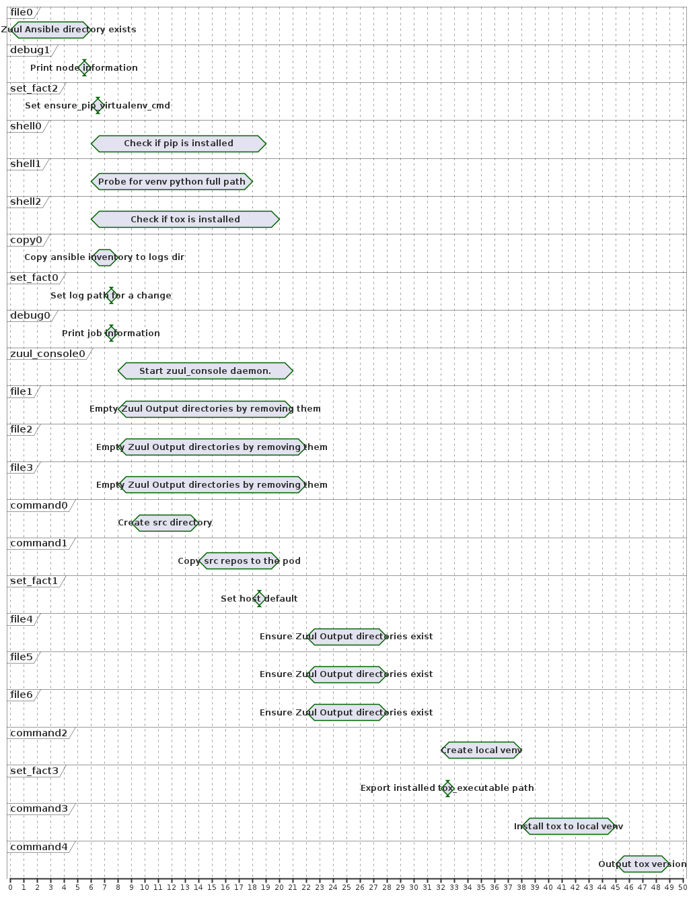

# Haxible - Ansible interpreter powered by Haxl

This project is a proof concept Ansible interpreter that leverages
the [Haxl](https://github.com/facebook/Haxl) library to evaluate
the playbook tasks concurrently.


## Why Haxl?

Pros:

- Haxl is a big hammer for solving problems involving I/O and concurrency: it flips the default from sequential to concurrent.
- Haxl comes with testing and debugging facilities.

Cons:

- The implementation is not written in Python.

> Learn more about Haxl in this short video: https://www.youtube.com/watch?v=sT6VJkkhy0o

Why Haskell?

- Suitable for large scale system.
- Statically typed with type inference.
- Fearless concurrency, without async/await, but with managed effects (IO and STM).


## Overview

Haxible does the following:

- Parse the playbook into a syntax tree.
- Annotate the tasks dependencies.
- Generate a Haxl program.
- Compile the generated code with the Glasgow Haskell Compiler.
- Perform the tasks through the `ansible-playbook` command.

Limitations:

- Each tasks run in a dedicated playbook: dynamic `add_host` is not currently implemented.
- Variable inheritance is simpler: local scope takes priority over global scope (as expected), therefore `include_vars` no longer overrides locally defined variables.
  In other words, the closer a variable is defined, the higher its priority: Task vars > Include vars > Play vars > Inventory vars > Role defaults > Extra vars.
- Tasks run concurrently by default, thus adding extra register/vars pairs may be required to force sequencial evaluation.
  Though Haxible may be improved to detect common pattern such as running `package` modules before `service` modules.


## Demo

Given this playbook:

```yaml
- hosts: localhost
  tasks:
    - name: Create network
      create_network:
        name: "private"
      register: network

    - name: Create instances
      create_instance:
        network: "{{ network.uid }}"
        name: "{{ item }}"
      loop:
        - backend
        - frontend
        - monitoring

    - name: Create storage
      create_volume:
        name: "db"
      register: storage

    - name: Create database
      create_instance:
        network: "{{ network.uid }}"
        name: "database"
        volume: "{{ storage.uid }}"

    - name: Create object
      create_object:
        name: "standalone-object"

    - name: Create network object
      create_object:
        name: "network-{{ network.uid }}"

    - name: Start local service
      include_role:
        name: "container-service"
```

Haxible runs three batches:

```
PLAY [concurrent] ***********************************************************************

TASK <17631> [Create network] ***********************************************************
ok: [localhost] <17631> => {"changed":false,"delay":null,"success":"ok","uid":"6b280cb6"}

TASK <17631> [Create network object] ****************************************************
TASK <17662> [Create object] ************************************************************
TASK <17663> [Create storage] ***********************************************************
TASK <17666> [Create instances] *********************************************************
TASK <17665> [Create instances] *********************************************************
ok: [localhost] <17631> => {"changed":false,"delay":null,"success":"ok","uid":"f8db2cc0"}

TASK <17631> [Create instances] *********************************************************
ok: [localhost] <17663> => {"changed":false,"delay":null,"success":"ok","uid":"b060e6d3"}

TASK <17663> [Create database] **********************************************************
ok: [localhost] <17666> => {"changed":false,"delay":null,"success":"ok","uid":"3ab9d5a3"}
ok: [localhost] <17662> => {"changed":false,"delay":null,"success":"ok","uid":"8c0e3f35"}
ok: [localhost] <17665> => {"changed":false,"delay":null,"success":"ok","uid":"1e4fa090"}
ok: [localhost] <17631> => {"changed":false,"delay":null,"success":"ok","uid":"d7adee85"}
ok: [localhost] <17663> => {"changed":false,"delay":null,"success":"ok","uid":"6977e877"}
```

Thanks to the Haxl library, the order of the operations is automatically arranged to maximize concurrency.


Here is a production zuul-jobs pre run report that demonstrates almost 2x improvement:




## Usage

Install the toolchain using [ghcup](https://www.haskell.org/ghcup/).

```ShellSession
$ cabal run haxible -- --help
Haxible - Ansible interpreter powered by Haxl

Usage: haxible --playbook FILE [--dry]

Available options:
  --help                   Show this help text
  --playbook FILE          YAML file to interpret
  --inventory FILE         Inventory path
  --dry                    Don't run the playbook, just compile it
```

Run the tests with `cabal test`.

Build the command line with `cabal build`.
